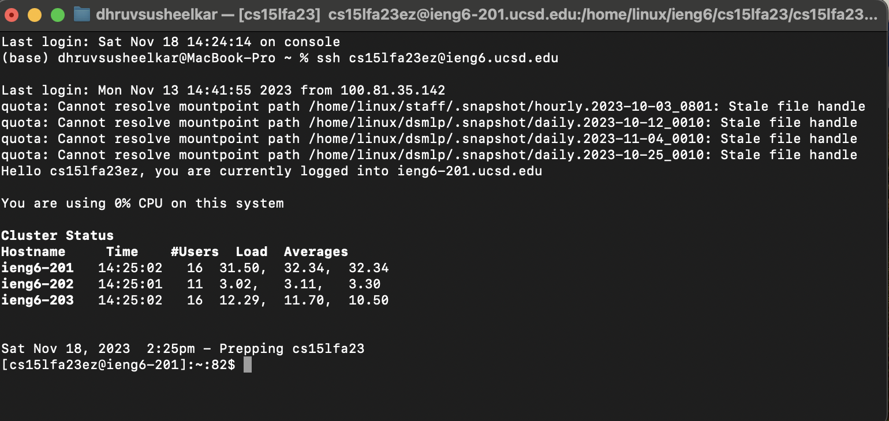
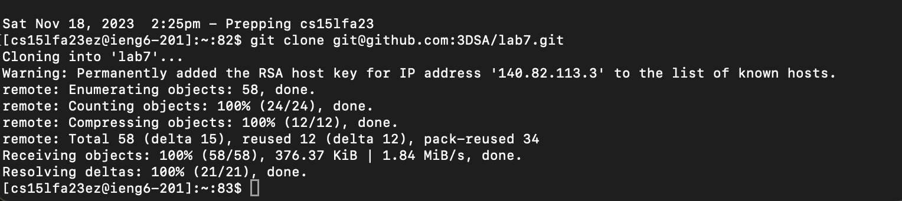
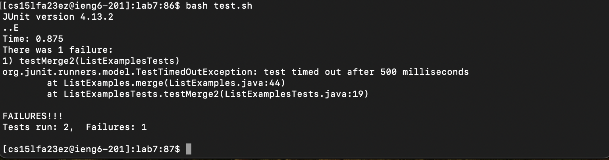
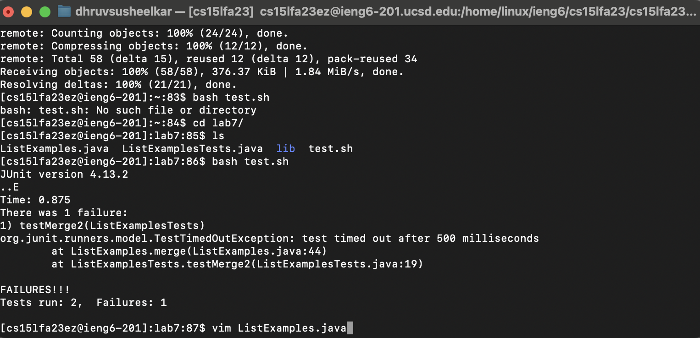
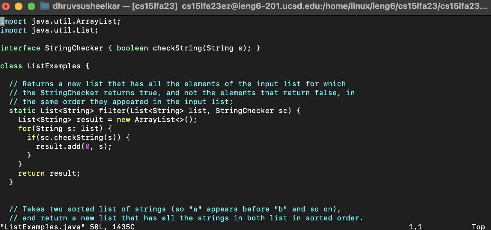
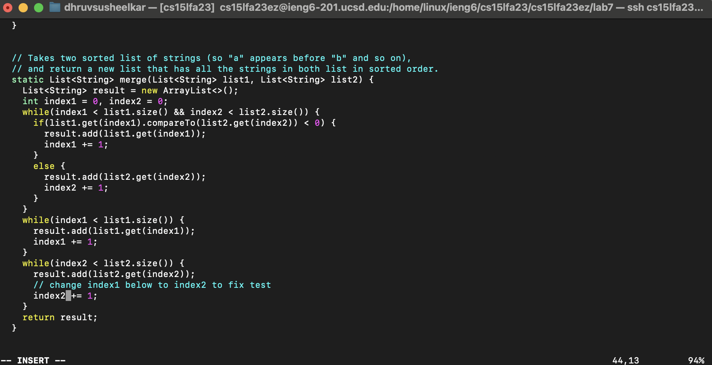
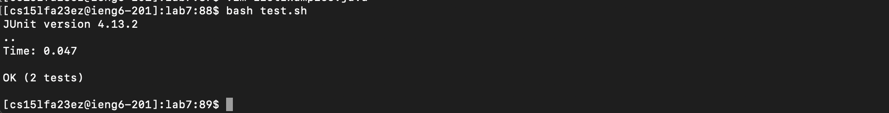
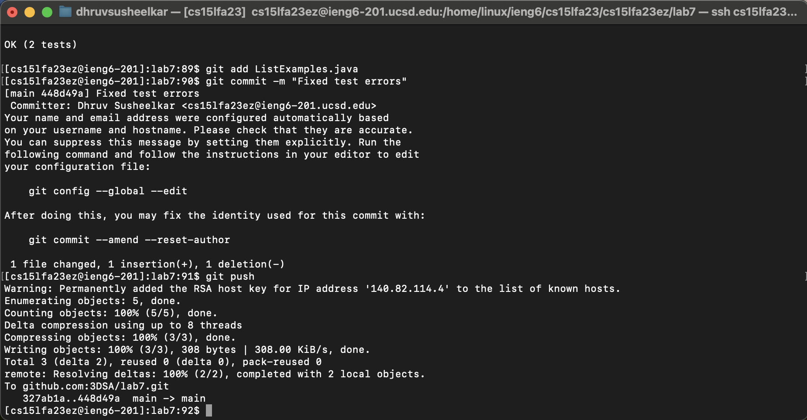
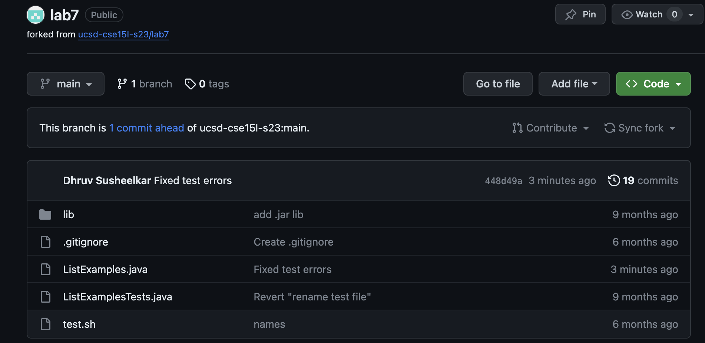

# Lab Report 4  
## 1. Login  
  
Explanation: I logged in to ieng6 with my username. It did not prompt for a password since I had set up the ssh key(finally worked).    

## 2. Clone with SSH URL  
  
Explanation: I first forked the lab7 repo on the GitHub website. Then I used the SSH URL to clone it.    

## 3. Tests  
  
Explanation: I run the tests using the command `bash test.sh`. There seems to be an error in `ListExamples.java` with `merge`.    

## 4. Edit Code  
  
  
Explanation: To start edit ListExamples.java, I used the command `vim ListExamples.java`.        
    
Explanation:  

## 5. New Tests  
  
Explanation:  

## 6. Git Push  
  
  
Explanation:  
